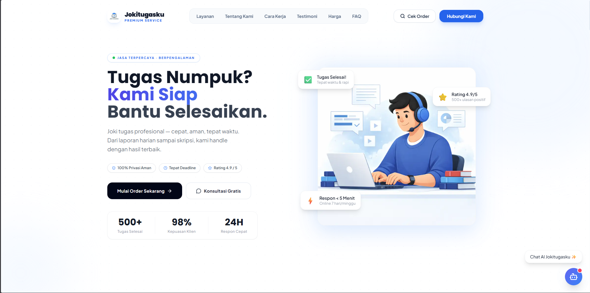

# 🎓 Jokitugasku — Platform Solusi Akademik Modern

[](https://nextjs.org/)
[](https://tailwindcss.com/)
[](https://supabase.com/)
[](https://www.framer.com/motion/)

**Jokitugasku** adalah aplikasi web modern berbasis Next.js yang dirancang khusus untuk mengelola layanan joki tugas akademik secara profesional. Dilengkapi dengan sistem pelacakan real-time, dashboard admin premium, dan asisten AI pintar.

---

## ✨ Fitur Unggulan

### 🚀 Landing Page Premium
Tampilan antarmuka yang bersih, responsif, dan interaktif menggunakan **Framer Motion** untuk animasi yang halus.

### 🔍 Real-time Order Tracking
Klien dapat memantau progres tugas mereka secara langsung menggunakan kode tiket unik. Status diperbarui secara instan melalui **Supabase Realtime**.

### 🤖 Smart AI Assistant
Integrasi dengan **Google Gemini AI** untuk membantu menjawab pertanyaan calon klien secara otomatis selama 24/7.

### 🛡️ Dashboard Admin Core
Sistem manajemen internal tingkat lanjut untuk:
- Mengelola antrean pesanan (Pending, In Progress, Review, Done).
- Sistem **Secure OTP** untuk penghapusan data sensitif.
- Manajemen Tim Admin (Multi-admin support).
- Monitoring ulasan dan revisi klien.

---

## 🛠️ Tech Stack

- **Frontend**: [Next.js 14](https://nextjs.org/) (App Router), [Tailwind CSS](https://tailwindcss.com/)
- **Backend/BaaS**: [Supabase](https://supabase.com/) (Auth, Database, Realtime)
- **AI**: [Google Gemini Pro API](https://ai.google.dev/)
- **UI Components**: [Lucide React](https://lucide.dev/), [Sonner](https://sonner.emilkowal.ski/), [Framer Motion](https://www.framer.com/motion/)

---

## 📸 Tampilan Aplikasi

<div align="center">
  
  <p><i>(Tambahkan screenshot dashboard & tracking widget Anda di sini untuk tampilan lebih menarik)</i></p>
</div>

---

## ⚙️ Instalasi Lokal

1. **Clone Repositori**
   ```bash
   git clone https://github.com/qwerty0999999/Jokitugasku.git
   cd Jokitugasku
   ```

2. **Instal Dependensi**
   ```bash
   npm install
   ```

3. **Konfigurasi Environment Variables**
   Buat file `.env.local` di root direktori dan isi dengan:
   ```env
   NEXT_PUBLIC_SUPABASE_URL=your_supabase_url
   NEXT_PUBLIC_SUPABASE_ANON_KEY=your_anon_key
   SUPABASE_SERVICE_ROLE_KEY=your_service_role_key
   GEMINI_API_KEY=your_gemini_api_key
   NEXT_PUBLIC_SUPER_ADMIN_EMAIL=your_email@example.com
   ```

4. **Jalankan Aplikasi**
   ```bash
   npm run dev
   ```
   Buka [http://localhost:3000](http://localhost:3000) di browser Anda.

---

## 📄 Lisensi

Proyek ini dibuat untuk tujuan manajemen layanan profesional. Hak Cipta &copy; 2026 **Jokitugasku**.

---

<div align="center">
  <p>Dibuat dengan ❤️ untuk kemajuan pendidikan</p>
</div>
